# Visualisation des données avec `ggplot2`

`ggplot2` est basé sur une grammaire de **couches**:

-   Data: dans `aes()` on retrouve les propriétés visuelles des objets
    du graphe;

-   Geoms;

-   Stats: permet de calculer directement des statistiques à l’intérieur
    de la fonction `ggplot2`, et quand on l’utilise on peut se passer de
    la définition de la couche `geom;`

-   Scale;

-   Coordinate systems;

-   Faceting: permet de faire des mini-plot pour un jeu de données.

Chaque couche hérite automatiquement les propriétés de la couche juste
avant.

## Les données

Simulation de dynamique moléculaire d’une protéine membranaire inserée
dans une double couche lipidique dans un cube d’eau. Mesure des
distances entre les différents monomère dans le fichier
`distance_intra.txt`.

    data_intra <- read.table("../../ggplot2_MD/Distances_intra.txt", header = T, sep = " ")

    # subset
    subset_intra <- data_intra[data_intra$run==1,]

    library(ggplot2)
    ggplot(data_intra, aes(x=Time, y=d1_3, col=monomer)) + geom_line() + facet_wrap(~run) + geom_hline(data=data_intra[data_intra$Time==0,], aes(yintercept=d1_3, col=monomer), linetype="dashed") + geom_point(data=data_intra[data_intra$Time==0,], col="black", shape=22, size=4, aes(fill=monomer))

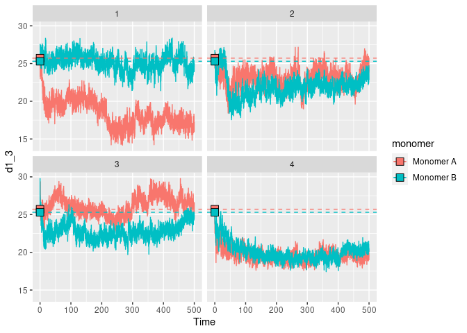

    ggplot(data_intra, aes(x=Time, y=d1_6, col=monomer)) + geom_line() + facet_wrap(~run) + geom_hline(data=data_intra[data_intra$Time==0,], aes(yintercept=d1_6, col=monomer), linetype="dashed") + geom_point(data=data_intra[data_intra$Time==0,], col="black", shape=22, size=4, aes(fill=monomer))

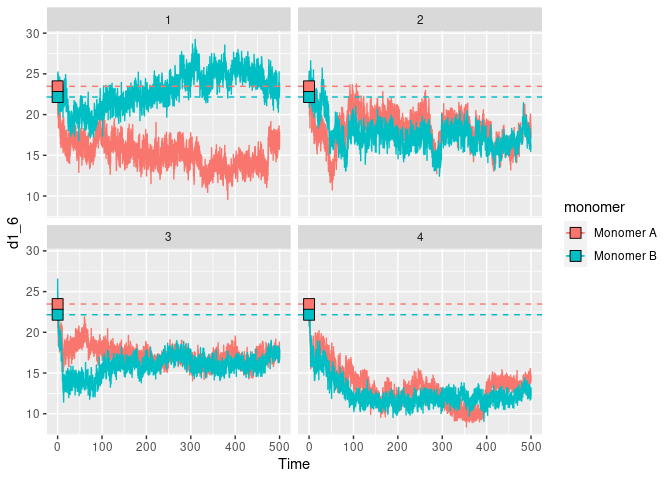

    ggplot(data_intra, aes(x=Time, y=d3_6, col=monomer)) + geom_line() + facet_wrap(~run) + geom_hline(data=data_intra[data_intra$Time==0,], aes(yintercept=d3_6, col=monomer), linetype="dashed") + geom_point(data=data_intra[data_intra$Time==0,], col="black", shape=22, size=4, aes(fill=monomer))

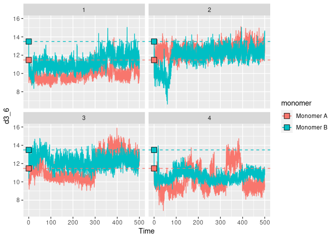

    ggplot(data_intra, aes(Time, d1_3)) + geom_line(col="orange") + facet_wrap(run~monomer, nrow=2) +geom_line(aes(Time, d1_6), col="blue") + geom_line(aes(Time, d3_6), col="gray")

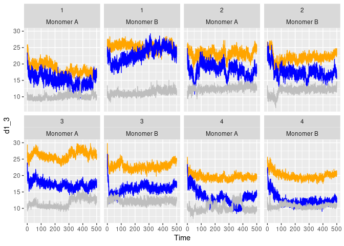

Re-élaboration du jeu de données, au lieu d’avoir une ligne pour mesure
de temps on construit un jeu de données ayant une ligne pour mesure de
temps et de distance mesurée.

    library(reshape)

    # rebase data, a line for every mesure
    data_intra_melt <- melt(data_intra, id=c("Time", "monomer", "run"), variable_names = "dist")
    head(data_intra_melt)

    ##   Time   monomer run variable value
    ## 1  0.0 Monomer A   1     d1_3 25.71
    ## 2  0.1 Monomer A   1     d1_3 25.84
    ## 3  0.2 Monomer A   1     d1_3 24.80
    ## 4  0.3 Monomer A   1     d1_3 24.65
    ## 5  0.4 Monomer A   1     d1_3 23.27
    ## 6  0.5 Monomer A   1     d1_3 24.51

    ggplot(data_intra_melt, aes(Time, value, col=variable)) + geom_line() + facet_wrap(~run*monomer, ncol=4)

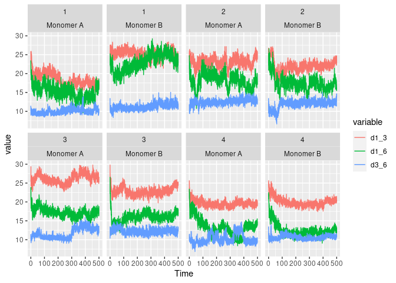

    ggplot(data_intra, aes(d1_3)) + geom_density(col="orange") + facet_wrap(run~monomer, nrow=2) +geom_density(aes(d1_6), col="blue") + geom_density(aes(d3_6), col="gray")

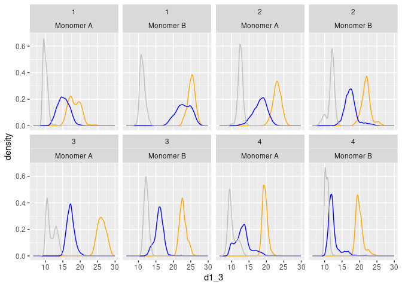

    ggplot(data_intra_melt, aes(value, col=variable, fill=variable)) + geom_density(alpha=0.5) + facet_wrap(~run*monomer, ncol=4) + geom_vline(data=data_intra_melt[data_intra_melt$Time==0,], aes(xintercept=value, col=variable))

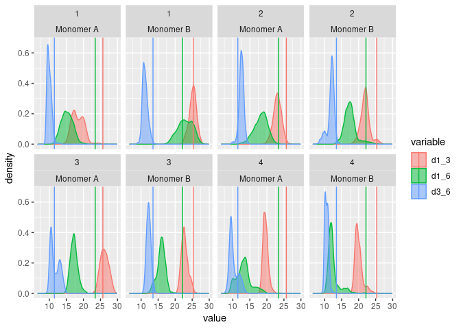

    # Mise en evidence d'une corrélation entre d1_3 et d1_6

    ggplot(data_intra, aes(d1_3, d1_6, col=Time)) + geom_path() + facet_wrap(run~monomer, nrow=2) + geom_rug(alpha=0.1) + geom_point(data=data_intra[data_intra$Time==0,], col="red") + scale_color_continuous(low="yellow", high="blue") 

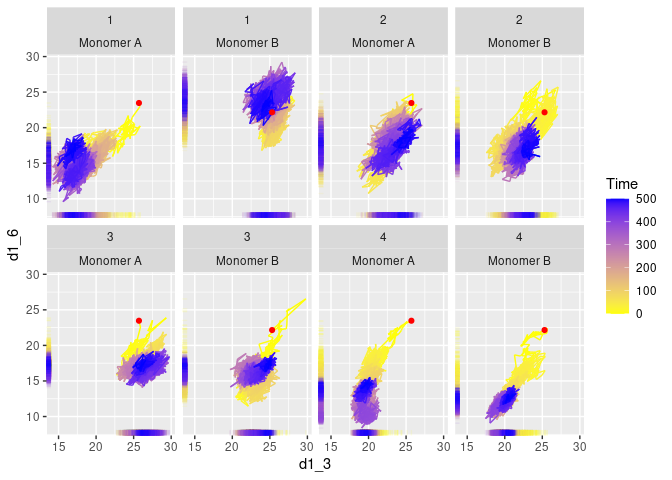

    #+ geom_density2d(aes(col=monomer))

## Dataset *Inter*

    data_inter <- read.table("../../ggplot2_MD/Distances_inter.txt", header =T, sep = " ")
    head(data_inter)

    ##   Time d1A_6A d1B_6B d1A_1B d6A_6B d1A_6B d6A_1B run
    ## 1  0.0  23.47  22.16  24.08  47.72  28.58  14.57   1
    ## 2  0.1  22.97  24.10  26.30  47.98  28.59  15.60   1
    ## 3  0.2  21.43  23.56  25.39  46.80  26.05  14.22   1
    ## 4  0.3  20.90  24.12  25.58  46.85  26.25  14.95   1
    ## 5  0.4  20.11  24.37  25.75  47.97  25.88  14.41   1
    ## 6  0.5  21.12  25.00  25.91  46.47  27.57  14.86   1

    ggplot(data_inter, aes(Time, d1A_6A)) + geom_line(col="orange") + facet_wrap(~run, nrow=2) +geom_line(aes(Time, d1B_6B), col="blue") + geom_line(aes(Time, d1A_1B), col="gray") + geom_line(aes(Time, d1A_6B), col="red") + geom_line(aes(Time, d6A_1B), col="purple")  + geom_line(aes(Time, d6A_6B), col="green")

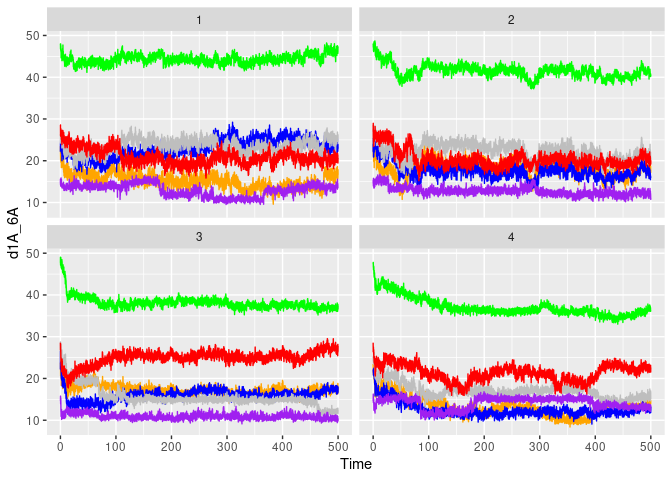

On voit que la distance `6A_6B` reste constante au cours du temps.

    # rebase data, a line for every mesure
    data_inter_melt <- melt(data_inter, id=c("Time", "run"), variable_names = "dist")
    head(data_intra_melt)

    ##   Time   monomer run variable value
    ## 1  0.0 Monomer A   1     d1_3 25.71
    ## 2  0.1 Monomer A   1     d1_3 25.84
    ## 3  0.2 Monomer A   1     d1_3 24.80
    ## 4  0.3 Monomer A   1     d1_3 24.65
    ## 5  0.4 Monomer A   1     d1_3 23.27
    ## 6  0.5 Monomer A   1     d1_3 24.51

    ggplot(data_inter_melt, aes(Time, value, col=variable)) + geom_line() + facet_wrap(~run, nrow=2) + geom_point(data=data_inter_melt[data_inter_melt$Time==0,], col="black", shape=21, size=3, alpha=0.8, aes(fill=variable)) + geom_point(data=data_inter_melt[data_inter_melt$Time==500,], col="black", shape=21, size=3, alpha=0.8, aes(fill=variable))

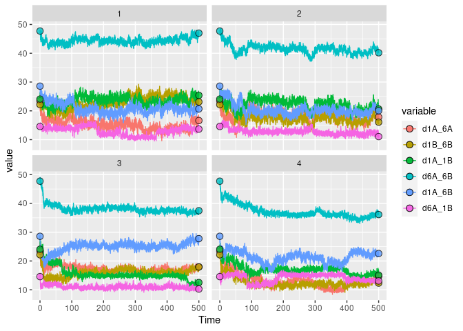

    ggplot(data_inter, aes(d6A_6B)) + geom_density(col="orange") + facet_wrap(~run, nrow=2) + geom_vline(data=data_inter[data_inter$Time==0,], aes(xintercept=d6A_6B, col="gray")) + geom_density(aes(d6A_1B), col="blue") + geom_vline(data=data_inter[data_inter$Time==0,], aes(xintercept=d6A_1B, col="blue")) + geom_density(aes(d1B_6B), col="gray") + geom_vline(data=data_inter[data_inter$Time==0,], aes(xintercept=d1B_6B, col="red"))

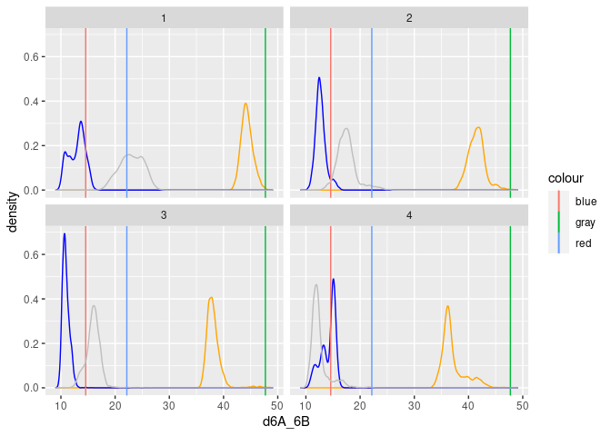

    ggplot(data_inter, aes(d6A_1B, d1A_6B, col=Time)) + geom_path() + facet_wrap(~run, nrow=2) + geom_rug(alpha=0.1) + geom_point(data=data_inter[data_inter$Time==0,], col="red") + scale_color_continuous(low="yellow", high="blue") 

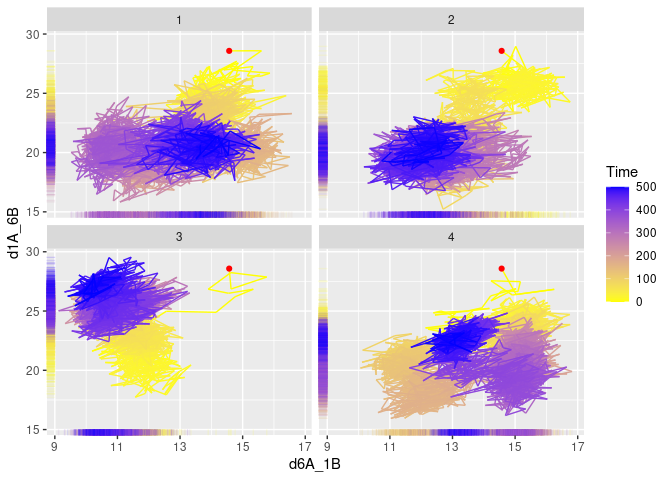

## Rendu TP

### Schéma des distances mesurées

    library(ggplot2)

    (ggplot(data_inter_melt, aes(Time, value, col=variable)) 
      # add time series
      + geom_line()
      # subplot by run on two different row
      + facet_wrap(~run, nrow=2)
      # plot the initial point for every time series
      + geom_point(data=data_inter_melt[data_inter_melt$Time==0,], col="black", shape=21, size=3, alpha=0.8, aes(fill=variable))
      # plot the final point for every time series
      + geom_point(data=data_inter_melt[data_inter_melt$Time==500,], col="black", shape=21, size=3, alpha=0.8, aes(fill=variable)))

Sur ces graphiques, on peut remarquer que la distance `d6A_6B` est la
plus grande pour les quatres simulations et que se distingue clairement
des autres *time-series*. On note aussi qu’il s’agit d’une des deux
“diagonales” réliant le monomère **A** au monomère **B** et qu’elle
semblerait être deux fois la distance de l’autre diagonale `d1A_1B`.
Au-delà de ça, les autres *time-series* sont de difficile
interprétation.

    (ggplot(data_inter, aes(d6A_6B, d1A_1B, col=Time)) 
      + geom_path(alpha=0.5) 
      + facet_wrap(~run, nrow=2) 
      + geom_rug(alpha=0.5) 
      + geom_point(data=data_inter[data_inter$Time==0,], col="red") 
      + scale_color_continuous(low="yellow", high="blue"))

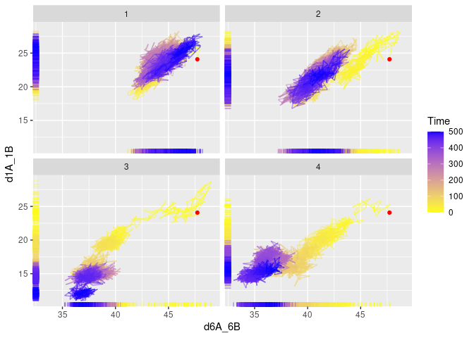

Dans cet graphique on montre la distance `d1A_1B` (diagonale mineure) en
fonction de la distance `d6A_6B` (diagonale majeure) avec le gradient
couleur qui tient compte de la variable temps; le point rouge répresente
la valeur initiale.

À l’execption de la simulation `1`, on peut observer la même tendance
pour les autre trois, au cours du temps (du jaune vers le bleu), les
distances des deux diagonales diminuent, cela peut suggérer un
rapprochement des deux monomères.
